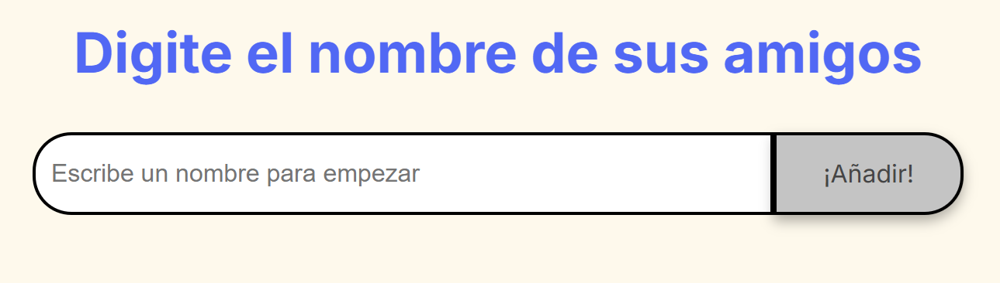
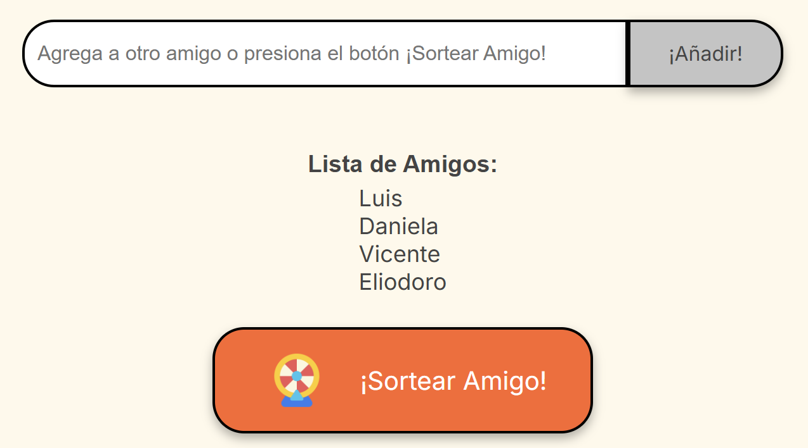

# Juego del Amigo Secreto con Esteroides 🎁

¡Bienvenido al Juego del Amigo Secreto con Esteroides!

  

## Descripción
Este es un proyecto simple desarrollado para sortear el amigo secreto entre un grupo de amigos. Se trata de una aplicación web que permite a los usuarios:

* Ingresar nombres en una lista.
* Realizar un sorteo aleatorio para determinar quién es el "amigo secreto" de cada persona.

El usuario agrega los nombres de sus amigos mediante un campo de texto y un botón llamado **"¡Añadir!"**:

  
      

Los nombres ingresados se mostrarán en una lista visible en la página, debajo del campo de texto y antes del botón **"¡Sortear Amigo!"**:

  
      

Al finalizar el ingreso de nombres, el botón **"¡Sortear Amigo!"** seleccionará un nombre de forma aleatoria, mostrará el resultado en pantalla e invitará a iniciar un nuevo juego:

  

## Funcionalidades
1.  **Agregar nombres:** Los usuarios pueden escribir el nombre de un amigo en un campo de texto y agregarlo a una lista visible al hacer clic en **"¡Añadir!"**.
2.  **Validar entrada:** Si el campo de texto está vacío, la aplicación mostrará una alerta pidiendo un nombre válido.
3.  **Visualizar la lista:** Los nombres ingresados aparecen en una lista debajo del campo de entrada.
4.  **Sorteo aleatorio:** Al hacer clic en el botón **"¡Sortear Amigo!"**, se selecciona un nombre aleatoriamente de la lista y se muestra en la página.

## Tecnologías utilizadas
* HTML
* CSS
* JavaScript
